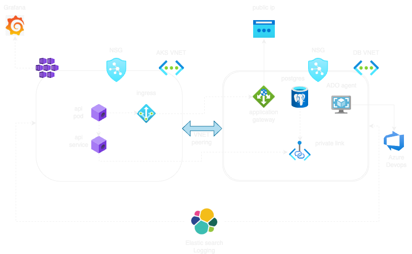

# Sample app which connects with database
This repo contains code for a Python Flask application.

The application overview is as follows

```
api <=> db
```

The folder `app` respectively describe how to install and run the app and run `unit test` cases.
The folder `components` includes the code to deploy terraform which uses modules present in the `modules` folder.
The folder `k8s` contains `helm` charts which are also being managed by `terraform`.

To deploy infra use `modules/bm-inra` which requires `infra.auto.tfvars` to be set as follows.

```
infra_vars = {
  "dev" = {
    "dev-1" = {
      aks_service_principal = {
        client_id     = "xx"
        client_secret = "xx"
      }
      pg_username = "appuser"
      pg_password = "xx"
      ssl_status  = "on"
      env         = "dev"
      vnet_addr_space = "xx"
      subnet_addr = "xx"
      appgw_vnet_addr_space = "xx"
      appgw_vm_subnet_addr = "xx"
      ado_agent_addr = "xx"
      pg_subnet_addr = "xx"
      appgw_subnet_addr = "xx"
    }
  }
  "prod" = {
    "prod-1" = {
      aks_service_principal = {
        client_id     = "yy"
        client_secret = "yy"
      }
      pg_username = "appuserprod"
      pg_password = "yy"
      ssl_status  = "on"
      env         = "prod"
      vnet_addr_space = "yy"
      subnet_addr = "yy"
      appgw_vnet_addr_space = "yy"
      appgw_vm_subnet_addr = "yy"
      ado_agent_addr = "yy"
      appgw_subnet_addr = "yy"
      pg_subnet_addr = "yy"
    }
  }
}
```

To segregate environments, use workspaces named `dev` and `prod` and have respective tfvars files for them. For example :

```
dev.tfvars
===============
env="dev"
location = {
    value  = "East US 2"
    suffix = "eastus2" # The corresponding value of location that is used by Azure in naming AKS resource groups
  }
```


# Diagram of the Application




